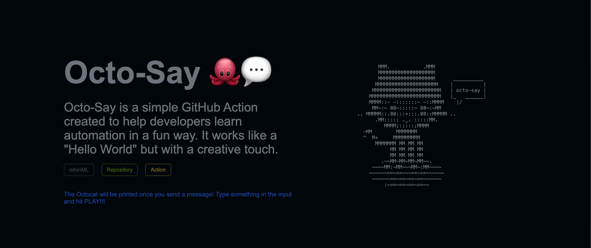
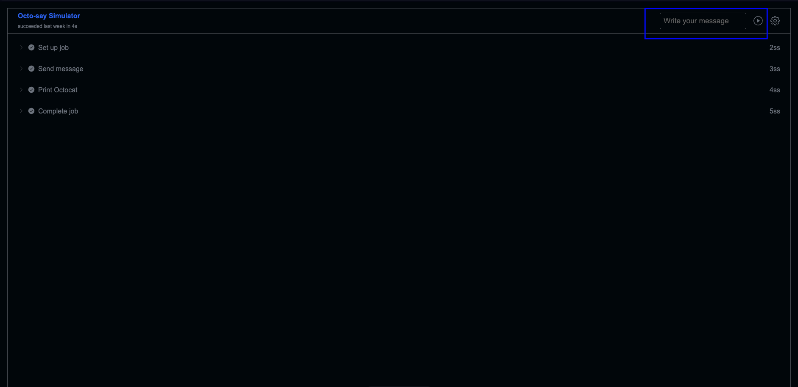
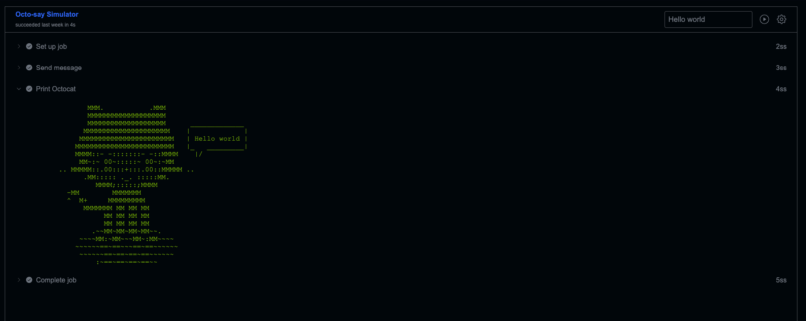

# Octo-Say-Simulator 🐙💬

A web-based simulator that replicates the GitHub Actions logging interface using Astro and the official Octocat API.

## What does it do?

It allows you to type a message and see it transformed into an Octocat ASCII drawing, just like in a real CI/CD pipeline.

## How to use it
1. Go to the website and read the instructions in blue.

2. Scroll down, type your message, and hit PLAY.

3. ...and it will show the Octocat ASCII art with your message.
